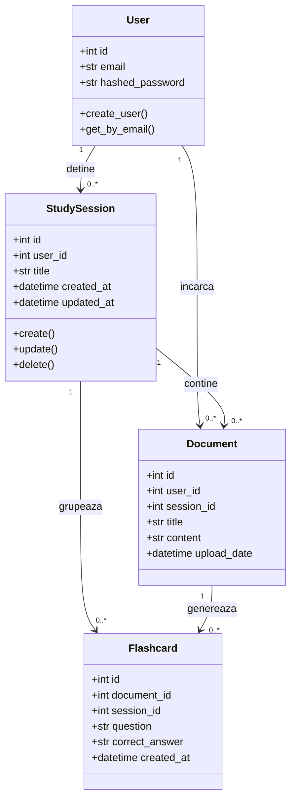
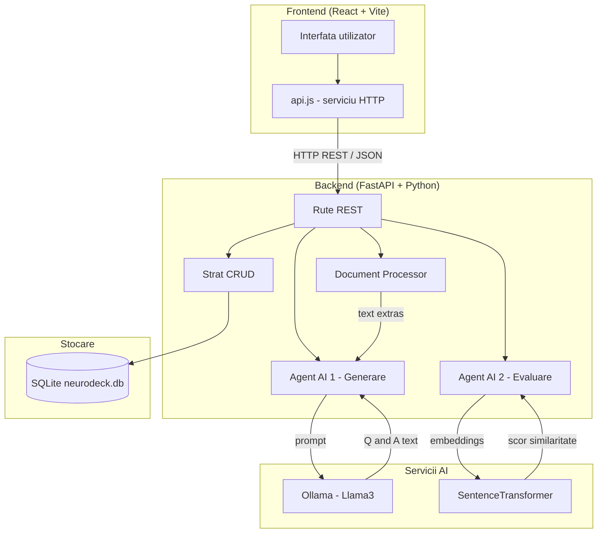
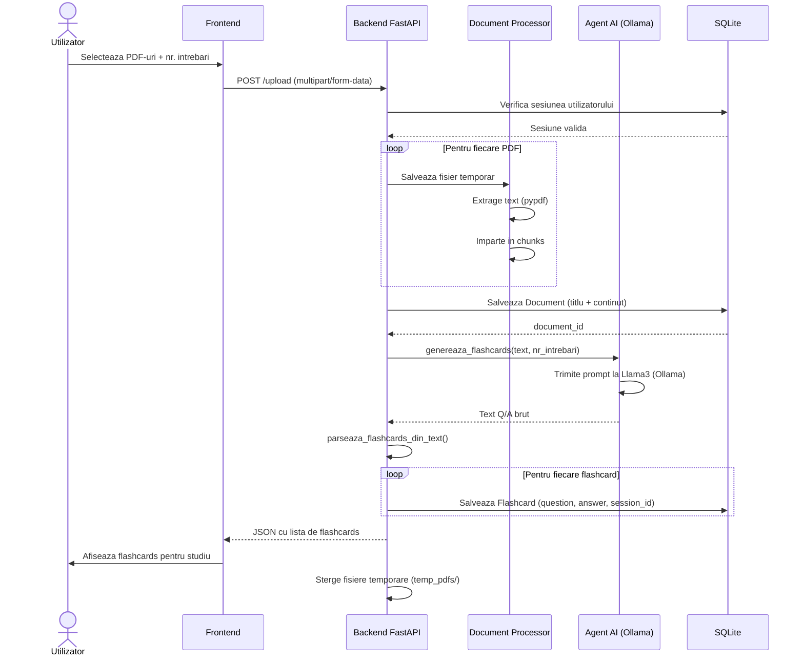
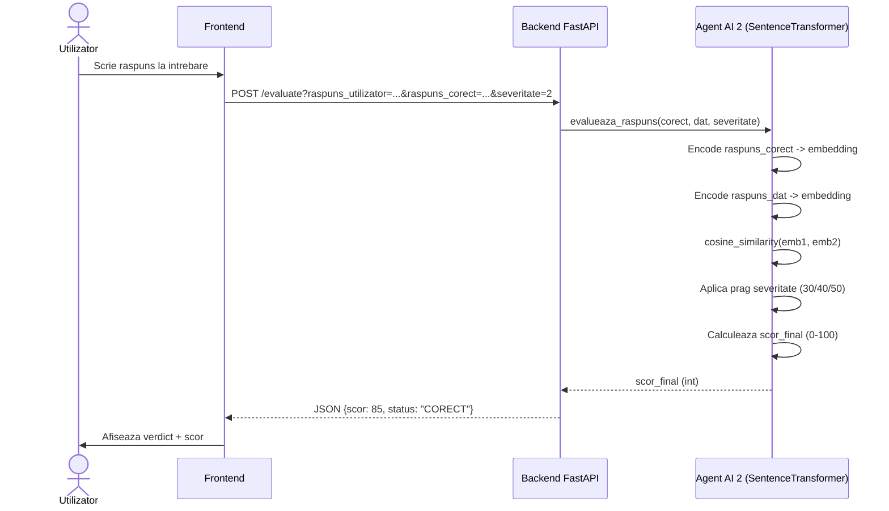
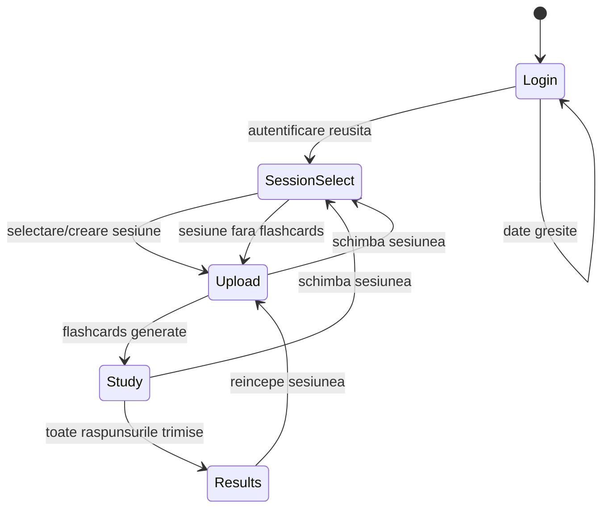

# Diagrame NeuroDeck

## 1. Diagrama claselor (UML)

---

## 2. Diagrama componentelor

---

## 3. Workflow principal — Upload PDF si generare flashcards

---

## 4. Workflow evaluare raspuns

---

## 5. Diagrama de stare — Frontend

